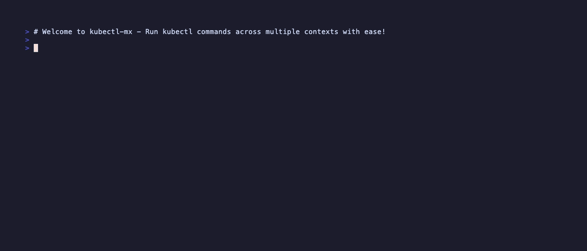

# kubectl-mx

[](https://github.com/elsesiy/kubectl-mx)
[](LICENSE)
[](https://www.rust-lang.org/)

A command-line tool that executes kubectl commands across multiple Kubernetes contexts matching a regex pattern, running them in parallel for efficiency.

## Key Features
- **Parallel Execution**: Run commands across multiple contexts simultaneously with configurable concurrency.
- **Dry-Run Mode**: Preview matching contexts and commands without execution.
- **Flexible Configuration**: Support for environment variables, config files, and command-line overrides.
- **JSON Output**: Structured output for easy processing with tools like jq.
- **Safety Features**: Confirmation prompts for large operations and retry logic for reliability.

## Table of Contents
- [Demo](#demo)
- [Installation](#installation)
- [Configuration](#configuration)
- [Usage](#usage)
- [How It Works](#how-it-works)
- [Development](#development)
- [Troubleshooting](#troubleshooting)
- [Contributing](#contributing)
- [License](#license)

## Demo



The demo shows common CLI operations including help, dry-run preview, and parallel execution across contexts.

## Installation

### Requirements
- kubectl configured with access to multiple contexts
- Rust 1.90+ (for building from source)

### Quick Install
Install via Cargo (recommended):
```bash
cargo install --git https://github.com/elsesiy/kubectl-mx.git
```

### Build from Source
1. Ensure Rust is installed from [rustup.rs](https://rustup.rs/).
2. Clone the repository:
   ```bash
   git clone https://github.com/elsesiy/kubectl-mx.git
   cd kubectl-mx
   ```
3. Build the project:
   ```bash
   make build
   ```
4. The binary will be available at `target/debug/kubectl-mx` (or `target/release/kubectl-mx` for optimized builds via `make release`).

## Usage

kubectl-mx allows you to run kubectl commands on multiple contexts simultaneously. Use a regex to select which contexts to target.

### Basic Syntax

```bash
kubectl-mx -r <regex> -e <kubectl_command> [command_args...]
```

The regex supports full regular expression syntax (e.g., `prod.*`, `cluster-[0-9]+`).

### Options

- `-r, --regex <REGEX>`: Regular expression to match kubectl context names. Required.
- `-e, --exec <CMD>...`: The kubectl command and arguments to execute. Required.
- `-d, --dry-run`: Preview matching contexts and commands without execution. Shows a preview and exits early.
- `--max-concurrency <N>`: Maximum number of concurrent kubectl commands (env: `KUBECTL_MX_MAX_CONCURRENCY`, default: 10).
- `--timeout <SECONDS>`: Timeout for each kubectl command in seconds (env: `KUBECTL_MX_TIMEOUT`, default: 30).
- `--retry <N>`: Number of retries for failed commands (with 1-second delay between attempts; env: `KUBECTL_MX_RETRY`, default: 0).
- `-q, --quiet`: Suppress kubectl output, only show progress and summary.
- `--json`: Output results in JSON format. Automatically adds `-o json` to kubectl commands if not already specified. Output includes a results array (with context, success, output/error) and a summary (total, succeeded, failed, elapsed time).
- `-h, --help`: Display help information.
- `-V, --version`: Display version information.

### Output Formats

- **Normal Mode**: Colored output with context headers for each command's result.
- **Quiet Mode**: Suppresses kubectl output; shows only progress bar and final summary with timing.
- **JSON Mode**: Structured output for scripting; includes results per context and overall summary.

### Examples

1. **Get pods from all production contexts:**
   ```bash
   kubectl-mx -r "prod" -e get pods
   ```

2. **Describe a specific deployment in staging contexts:**
   ```bash
   kubectl-mx -r "staging" -e describe deployment my-app
   ```

3. **Apply a YAML file to contexts matching a pattern:**
   ```bash
   kubectl-mx -r "cluster-[0-9]+" -e apply -f config.yaml
   ```

4. **Dry run to see which contexts would be affected:**
   ```bash
   kubectl-mx -r "dev" -e get nodes -d
   ```
   This will output the matching contexts and the command that would be run.

5. **Output results in JSON format:**
   ```bash
   kubectl-mx --json -r "prod" -e get pods
   ```
   This will output the results as JSON (kubectl commands automatically get `-o json` added), making it easy to process with tools like jq.

6. **Process JSON output with jq:**
   ```bash
   kubectl-mx --json -r "prod" -e get pods | jq '.results[] | select(.success) | .output'
   ```
   Filters successful results and extracts kubectl output.

7. **Run with limited concurrency:**
   ```bash
   kubectl-mx -r ".*" -e get pods --max-concurrency 5
   ```
   This limits concurrent commands to 5, useful for large numbers of contexts.

8. **Run with custom timeout:**
   ```bash
   kubectl-mx -r "prod" -e get nodes --timeout 60
   ```
   Sets a 60-second timeout per command.

9. **Run with retries:**
   ```bash
   kubectl-mx -r "staging" -e apply -f config.yaml --retry 3
   ```
   Retries failed commands up to 3 times with a 1-second delay.

10. **Run in quiet mode:**
    ```bash
    kubectl-mx -r ".*" -e get pods -q
    ```
    Suppresses kubectl output, showing only progress and final summary with timing.

11. **Run a complex command with multiple arguments:**
    ```bash
    kubectl-mx -r ".*" -e logs -f deployment/my-deployment --tail=100
    ```
12. **Use environment variables for defaults:**
    ```bash
    export KUBECTL_MX_MAX_CONCURRENCY=5
    export KUBECTL_MX_TIMEOUT=120
    kubectl-mx -r "prod" -e get pods
    ```
    This runs with concurrency of 5 and timeout of 120 seconds, unless overridden by command-line args.


## Development

This project uses a Makefile for common development tasks:

- `make build`: Build the project in debug mode
- `make release`: Build the project in release mode
- `make test`: Run all tests
- `make lint`: Run the linter (clippy)
- `make fmt`: Format the code (modifies files)
- `make fmt-check`: Check files are correctly formatted
- `make check`: Check code without building
- `make clean`: Clean build artifacts
- `make run`: Run the binary
- `make doc`: Generate documentation
- `make install`: Install the binary to your system

### Integration Testing

The project includes integration tests that require real Kubernetes clusters. To run them:

1. Ensure [kind](https://kind.sigs.k8s.io/) is installed
2. Set up test clusters:
   ```bash
   make setup-clusters
   ```
3. Run integration tests (clusters must be set up first):
   ```bash
   make test-integration
   ```
4. Clean up clusters:
   ```bash
   make teardown-clusters
   ```

The setup creates 3 kind clusters (`kind-test1`, `kind-test2`, `kind-test3`) for testing multi-context functionality.

## Troubleshooting

### Common Issues
- **No contexts match the regex**: Verify your regex with `kubectl config get-contexts`. Use `kubectl-mx -r ".*" -d` to see all contexts.
- **kubectl not found**: Ensure kubectl is installed and in your PATH.
- **Permission denied on contexts**: Check that your kubeconfig has access to the contexts (e.g., via `kubectl --context <name> get pods`).
- **Large number of contexts**: For >20 matches, kubectl-mx prompts for confirmation; use `--json` to skip or adjust your regex.
- **Timeouts or failures**: Increase `--timeout` or check network/connectivity for the affected contexts.

## Configuration

kubectl-mx supports configuration via environment variables and an optional TOML config file. The precedence order is: command-line arguments > environment variables > config file > built-in defaults.

### Environment Variables

You can set defaults using environment variables:

- `KUBECTL_MX_MAX_CONCURRENCY`: Maximum number of concurrent kubectl commands (default: 10)
- `KUBECTL_MX_TIMEOUT`: Timeout for each kubectl command in seconds (default: 30)
- `KUBECTL_MX_RETRY`: Number of retries for failed commands (default: 0)

### Config File

kubectl-mx also supports an optional TOML config file following the XDG Base Directory specification, located at `$XDG_CONFIG_HOME/kubectl-mx/config.toml` or `~/.config/kubectl-mx/config.toml` if `XDG_CONFIG_HOME` is not set.

Command-line args take precedence: `kubectl-mx --max-concurrency 5 ...` overrides both env vars and config file values.

Example `~/.config/kubectl-mx/config.toml`:
```toml
max_concurrency = 20
timeout = 60
retry = 2
```

## How It Works

1. kubectl-mx fetches all available kubectl contexts.
2. It filters contexts using the provided regex.
3. For >20 matching contexts, prompts for confirmation (unless in JSON mode) to prevent unintended bulk operations.
4. For each matching context, it runs the specified kubectl command in parallel (controlled by a semaphore for concurrency).
5. Commands are timed out per the configured limit, with retries on failure (1-second delay between attempts).
6. Output is collected asynchronously per context and displayed with context names for easy identification.
7. In non-JSON mode, a progress bar shows execution status; final summary includes success/failure counts and elapsed time.

## Contributing

Contributions are welcome! Please feel free to submit a Pull Request. See [Issues](https://github.com/elsesiy/kubectl-mx/issues) for bug reports or feature requests.

## License

This project is licensed under the MIT License.
